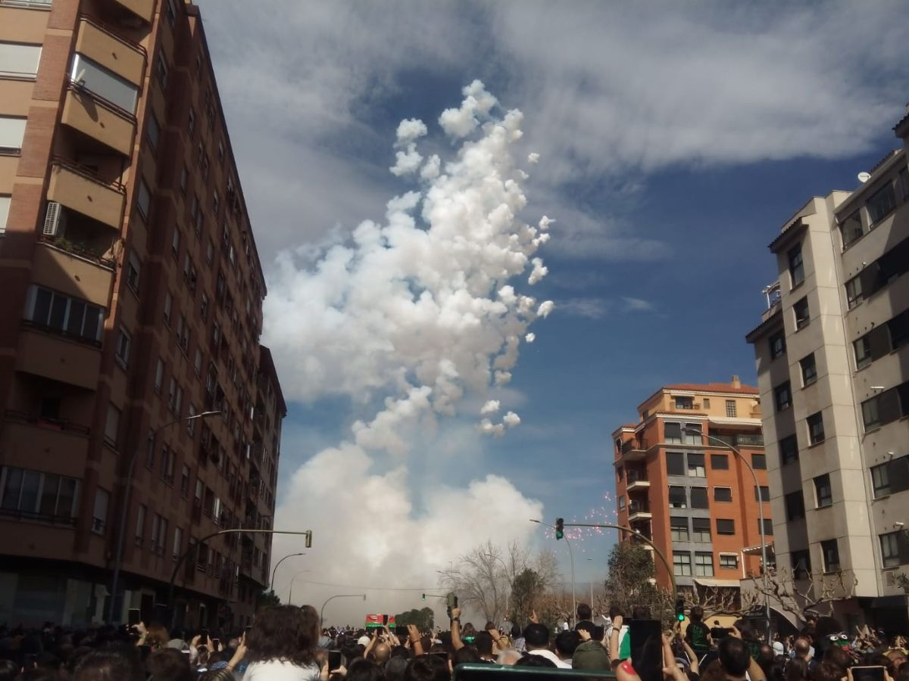

# Festes de la Magdalena
## Què és?
Les **Festes de la Magdalena** són les festes majors de Castelló de la Plana. Es commemoren els orígens de la ciutat, en record històric del trasllat de la ciutat de la muntanya al pla fèrtil.

Comencen el tercer dissabte de quaresma, amb l'auninci del pregoner. El diumenge és la romeria, l'event més significatiu.

Els símbols d'aquestes festes són l'escut de la ciutat, la llum, la canya i el rotllo.

Aquestes festes són la combinació de l'història amb la diversió, per a grans i petits, per a gent de tot el món.

## Events principals
### Mascletà

### Romeria

### Encesa de gaiates

### Concurs de paelles

### Cos multicolor

### Fira taurina

